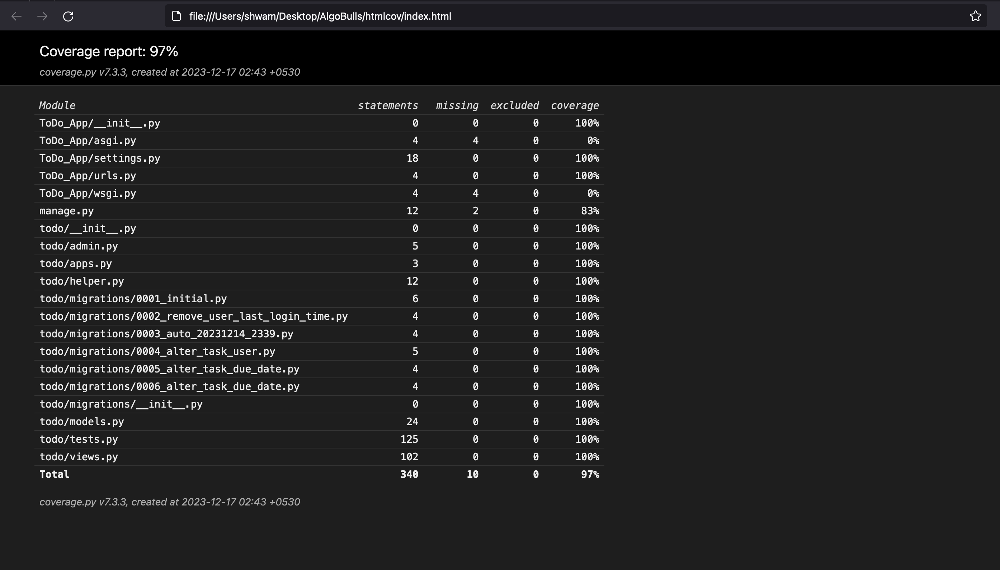
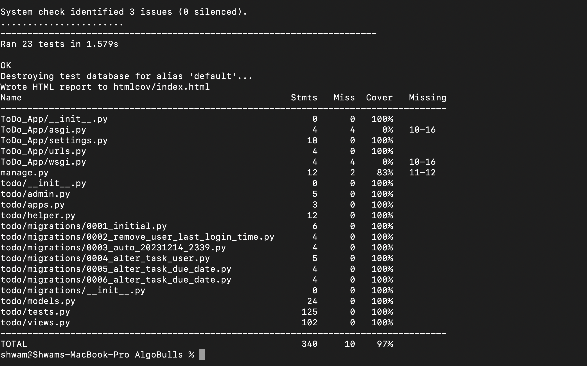

# **AlgoBulls Assignment**

Root Folder -> AlgoBulls

Go to terminal, and enter these commands

pip install -r requirements.txt

pip install -r dev-requirements.txt

then hit **python manage.py runserver**

****Authentication** -> Token based(make_password, check_password)
**

To convert the scripts into executable, type chmod +x (filename for scripts)
for example -> chmod +x ./lint-sh

**For Linting Tools** -> ./check-lint.sh, ./lint-sh

**For Generating Coverage** -> ./generate-coverage-report.sh
